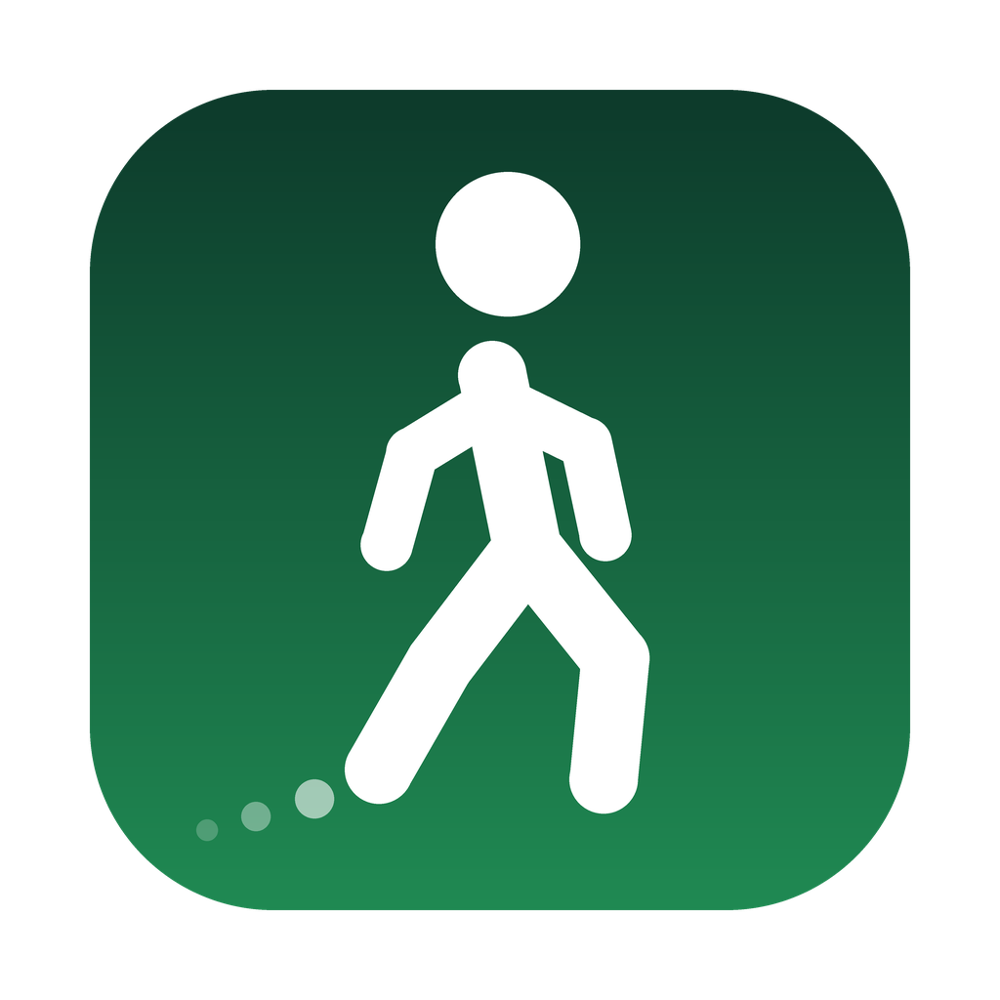
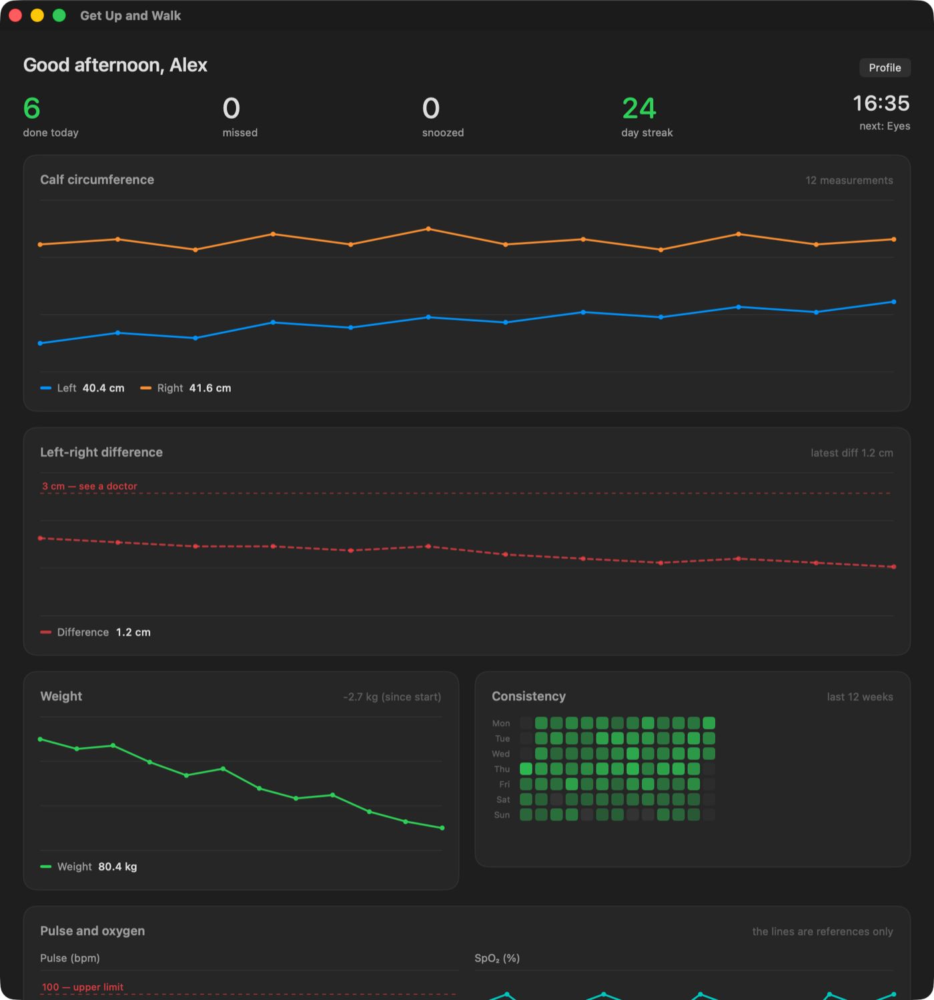
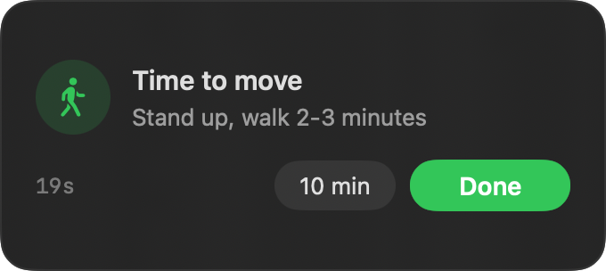
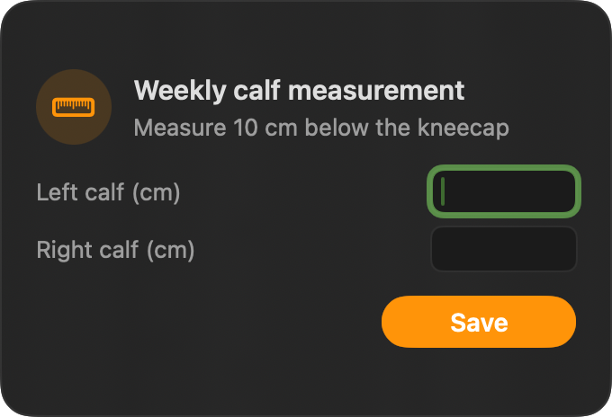
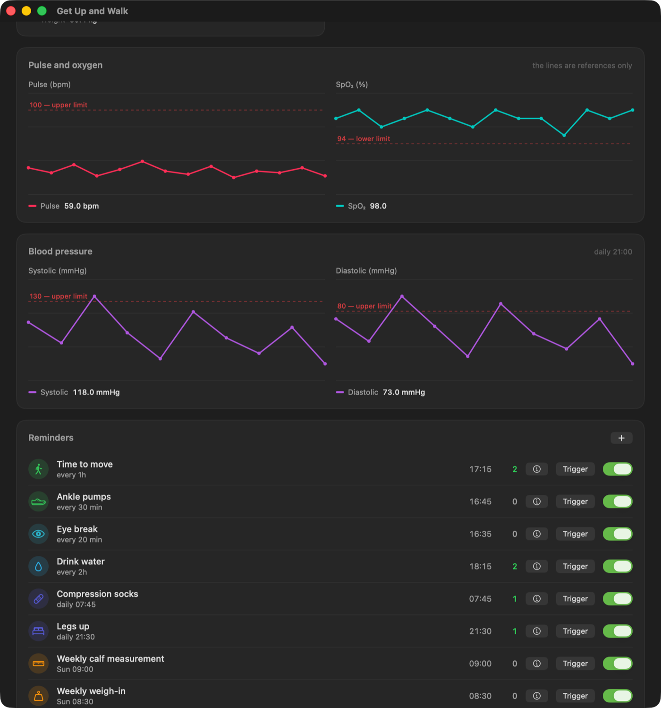
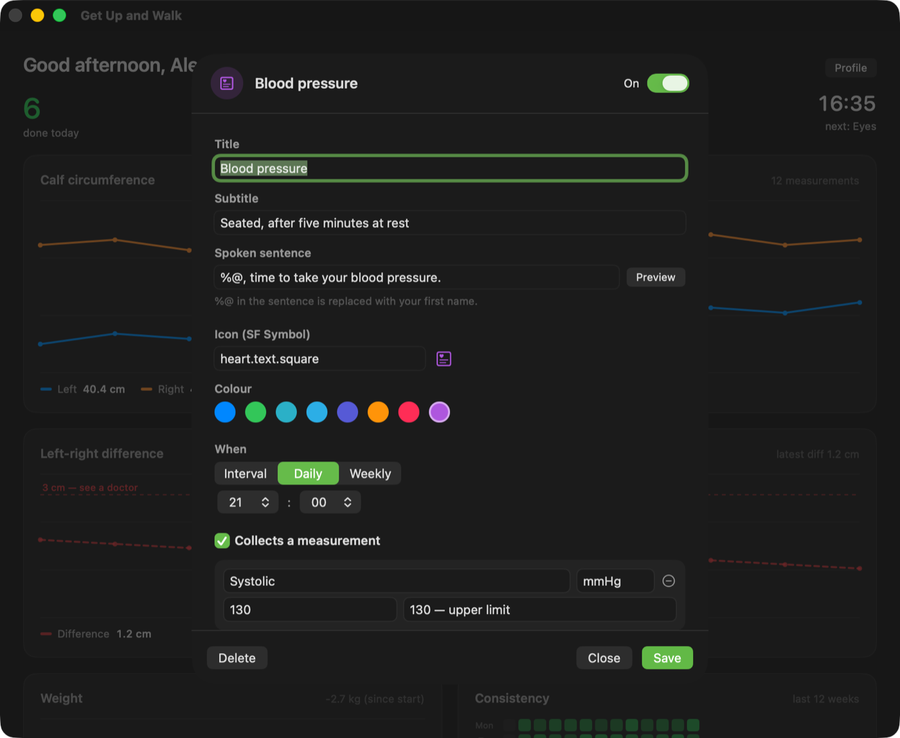

# Get Up and Walk

[](https://github.com/nrkdrk/get-up-and-walk/actions/workflows/build.yml)
[](https://github.com/nrkdrk/get-up-and-walk/releases/latest)

A macOS menu-bar app that breaks a desk-bound day into healthy intervals — and keeps a record so you can see the trend. No dependencies, one command to build.

<p align="center">
  
</p>

<p align="center">
  
</p>

> The screenshots on this page come from a demo profile with sample measurements.

## Why

Sitting for hours slows circulation, pools blood in the legs, and wears down the neck and shoulders. Most break reminders nag you about one thing and keep no record. This one manages several reminders from a single place, logs every outcome, and charts what you measure.

The interface and the spoken reminders come in Turkish and English. Everything else — code, comments, build output — is English.

## What it does

**Reminders.** A small card appears near the top of the screen, plays a soft chime, then speaks your name: *"Alex, you need to stand up and walk."* It closes itself after 20 seconds. **Done** logs a completion, timing out logs a miss, **10 min** snoozes. Reminders that collect a number stay open and take keyboard focus instead.

<table>
<tr>
<td width="50%"></td>
<td width="50%"></td>
</tr>
</table>

| Reminder | Schedule | On by default |
|---|---|---|
| Time to move | hourly | yes |
| Drink water | every 2h | yes |
| Compression socks | daily 07:45 | depends on profile |
| Legs up | daily 21:30 | depends on profile |
| Weekly weigh-in | Sunday 08:30 | yes |
| Weekly calf measurement | Sunday 09:00 | depends on profile |
| Ankle pumps | every 30 min | depends on profile |
| Eye break (20-20-20) | every 20 min | no |
| Resting pulse | daily 08:00 | no |
| Blood oxygen | daily 08:05 | no |

Each can be toggled independently from the menu bar or the dashboard. You can also write your own — see **Adding a reminder** below.

**Stays out of the way.** Interval reminders never fire outside your active hours (default 08:00–23:00). Nothing fires while the screen is locked, or after ten minutes without keyboard or mouse input — you are already away from the desk, so logging a "miss" would be wrong. The reminder window is a non-activating panel: it never steals focus while you type.

**Measurement tracking.** The weekly weigh-in and calf measurement prompt for numbers instead of a plain acknowledgement, and so do the two optional vitals. Asymmetry is the number worth watching in a calf, so the difference gets a chart of its own: left and right share one scale, and the difference between them sits on a second chart pinned to include 0 and the 3 cm line. On a shared axis a 2 cm difference and a 3 cm threshold are a pixel apart, which reads as though the reading sits on the line — separating them is what makes the distance legible.

**Optional vitals.** Resting pulse and blood oxygen are off by default. Their subtitles say when to take the reading — before getting up, after five minutes at rest; fingertip, hand warm and still — because a measurement taken any other way is noise, not information. Once a day is the whole point; measuring more often produces a chart of your circumstances, not your health. Their charts carry a dashed line at 100 bpm and 94 %, and that is all they do: the app draws the line and plots the point. It renders no verdict, colours nothing by judgement, and raises no alerts.

**Dashboard.** ⌘D opens a window with today's summary, your day streak, calf and weight trends, a 12-week consistency heatmap, and a table of every reminder with its next fire time. Further down are the optional vitals and anything you measure yourself — the blood-pressure card below is a user-written reminder, not a built-in one.

<p align="center">
  
</p>

**Your data stays local.** Everything lives in `~/Library/Application Support/GetUpAndWalk/log.json`. No network calls, no account, no telemetry. One menu click exports a CSV to the Desktop, which is handy to bring to a doctor's appointment.

## Install

### Download the built app

Take the `.dmg` from the [latest release](https://github.com/nrkdrk/get-up-and-walk/releases/latest), open it, and drag the app into Applications. One universal build covers Apple Silicon and Intel. Every release is built and packaged by GitHub Actions from the tagged commit, and ships a `.sha256` next to it.

**The first launch needs one extra step, and it is worth understanding why.** The build is ad-hoc signed and not notarized by Apple, because notarizing means paying for a Developer ID. macOS therefore refuses to open it, sometimes claiming the app is damaged. It is not damaged; that message is what any un-notarized app looks like from the outside. To open it anyway:

- **macOS 15 and later** — try to open it once, dismiss the warning, then go to **System Settings → Privacy & Security**, scroll to the message naming Get Up and Walk, and press **Open Anyway**.
- **Earlier versions** — Control-click the app in Finder, choose **Open**, then **Open** again in the dialog.
- **Or in a terminal** — `xattr -dr com.apple.quarantine /Applications/GetUpAndWalk.app`

You are taking my word that the binary matches the source. If you would rather not, the alternative below is one command.

### Build it yourself

Requires Xcode Command Line Tools (`xcode-select --install`). Nothing else.

```bash
git clone https://github.com/nrkdrk/get-up-and-walk.git
cd get-up-and-walk
./build.sh
open GetUpAndWalk.app
```

A local build targets your own machine. `UNIVERSAL=1 ./build.sh` produces the two-architecture binary the releases ship.

### Either way

To keep it running, move `GetUpAndWalk.app` to `/Applications` and add it under **System Settings → General → Login Items**.

On first launch you fill in a short profile: language, name, height, weight, and — optionally — whether you have varicose or leg vein complaints. That last answer decides which leg-circulation reminders start switched on. Every reminder stays individually adjustable afterwards.

The app lives entirely in the menu bar and never appears in the Dock. If you cannot find its icon on a MacBook Pro, the menu bar is probably full and the icon is hidden behind the notch — remove another icon to make room.

## Project layout

```
src/Model.swift        reminder definitions, profile, localization
src/ReminderStore.swift built-in and user-written definitions
src/Store.swift        scheduling engine, log, speech
src/Reminder.swift     reminder panel and card
src/Charts.swift       hand-drawn charts, heatmap
src/Editor.swift       reminder editor sheet
src/Onboarding.swift   profile setup screen
src/Dashboard.swift    dashboard window
src/App.swift          menu bar, app entry point
build.sh              compile, icon, bundle
make_icon.py          icon generation (needs Pillow)
assets/icon.png        source icon, converted to .icns at build time
assets/screenshots/    README screenshots
```

`build.sh` compiles every `.swift` under `src/`, converts `assets/icon.png` into an `.icns` with `sips` and `iconutil`, writes `Info.plist`, and ad-hoc signs the bundle. GitHub Actions runs the same script on every push.

Pushing a `v*` tag runs it again with `UNIVERSAL=1`, packages the bundle into a `.dmg`, and attaches it to a release. That job refuses to publish if the tag and `CFBundleShortVersionString` disagree, so a release can never claim a version the bundle does not carry.

Charts are drawn by hand with `Path` rather than Swift Charts. That keeps the build dependency-free and makes room for things a stock chart will not give you, like the threshold line.

## Adding a reminder

<p align="center">
  
</p>

**In the app.** Press **＋** in the dashboard's Reminders card, or pick *New reminder…* from the menu bar. You give it a title, a spoken sentence, an SF Symbol, a colour, and a schedule — every so many minutes, daily at a time, or weekly on a day. Switch on **Collects a measurement** and it prompts for up to three numbers instead of a plain acknowledgement; each field can carry its own dashed reference line. Anything you measure gets its own dashboard chart and its own CSV column. Custom reminders live in `~/Library/Application Support/GetUpAndWalk/custom-reminders.json`. Deleting one leaves its logged history in the log file.

**In the code.** Built-ins are cases of the `Kind` enum in `src/Model.swift`; each one returns a `ReminderDef`, the same value type user-written reminders decode into. The scheduler, the reminder panel, the dashboard, the CSV export, and both languages read `ReminderDef` and never the enum, so filling in a new case is all it takes.

## Disclaimer

This is a software tool, not a medical device. Its reminders and thresholds come from general health guidance; it does not diagnose or treat anything. The 3 cm calf-asymmetry line is a widely cited clinical rule of thumb, included as a prompt to seek advice — not as a diagnosis.

The same holds for the vitals. The 100 bpm and 94 % lines mark where a reading is worth mentioning to a doctor, nothing more. A single number below or above a line is not a diagnosis, and neither is a run of them: a consumer pulse oximeter is affected by cold hands, nail polish, movement, and skin tone, and a resting pulse moves with sleep, caffeine, illness, and stress. The app deliberately renders no verdict on any reading — it draws the line, plots the point, and leaves the reading to you and your doctor. Do not use it to rule anything out.

If you have swelling, pain, warmth, discoloration, or one-sided asymmetry in a leg, see a doctor. Sudden one-sided calf swelling with pain warrants same-day attention. Shortness of breath or chest pain warrants urgent attention whatever a number on a screen says. The records this app keeps are data you can bring to a consultation, never a substitute for one.

## License

MIT
